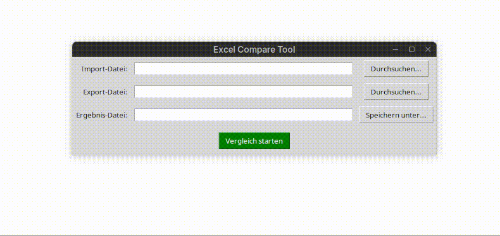

# Excel Import Verifier


[](README_en.md)
[](README.md)

## Problem

After importing data into HR systems, there are often no clean logs confirming whether all records were transferred correctly. Manual comparison of import and export files is error-prone and time-consuming — with 500 employees, that can take 40+ minutes.

## Solution

This tool automatically compares import and export files and highlights mismatches directly in the import file. Results in 2 minutes instead of 40.

## Demo



## Features

- GUI for file selection — no coding required
- Compares two Excel files (import vs. export)
- Employee matching by Personalnummer, Vorname, Nachname (at least 2 of 3 must match)
- Mismatches highlighted directly in the import file:
  - **Red** — no match or field-level difference
  - **Orange** — multiple potential matches found
- Field-specific comparison logic:
  - Names (ignores case, spaces, hyphens)
  - Email (case-insensitive)
  - Date fields (normalized to `DD.MM.YYYY`)
  - HR fields like Familienstand, Elterneigenschaft
- Saves result as a new Excel file

## Usage

1. Install dependencies:
```bash
pip install openpyxl
```
2. Run the tool:
```bash
python imexportchk.py
```
3. Select import file, export file, and output path
4. Start comparison

## Test Data

Sample files are available in the `example_data/` folder.

## Status

Developed and tested with anonymized HR data.
Not tested against all HR system export formats.

## Technologies

- Python 3.x
- openpyxl
- tkinter

## License

MIT License — see [LICENSE](LICENSE)
